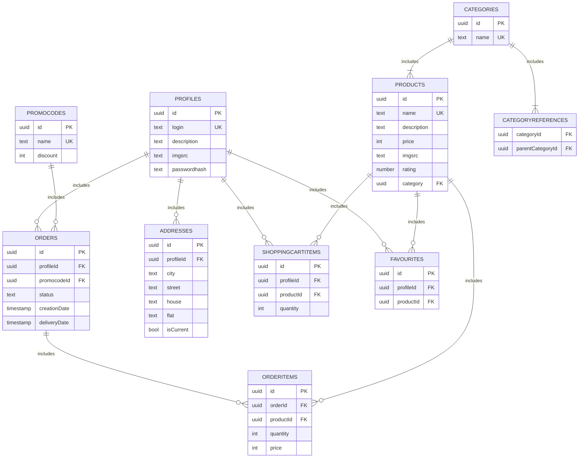

# Фунциональные зависимости
- Таблица profile
   - {id} -> login, description, imgsrc, passwordhash
   - {login} -> id, description, imgsrc, passwordhash

- Таблица product
    - {id} -> name, description, price, imgsrc, rating, categoryId
    - {name} -> id, description, price, imgsrc, rating, categoryId

- Таблица order_info
    - {id} ->  profileId, promocodeId, status, deliveryDate, creationDate

- Таблица order_item
    - {id} -> quantity, orderId, productId
    - {orderId, productId} -> id, quantity

- Таблица favorite
    - {id} -> profileId, productId
    - {profileId, productId} -> id

- Таблица address
    - {id} -> profileId, city, street, house, flat, isCurrent
    - {profileId, city, street, house, flat} -> id, isCurrent

- Таблица category
    - {id} -> name
    - {name} -> id

- Таблица category_refference
    - {id} -> categoryId, parentCategoryId
    - {categoryId} -> id, parentCategoryId

- Таблица shopping_cart_item
    - {id} ->  quantity, profileId, productId
    - {profileId, productId} - id, quantity

- Таблица promocode
    - {id} -> name, discount
    - {name} -> id, discount

