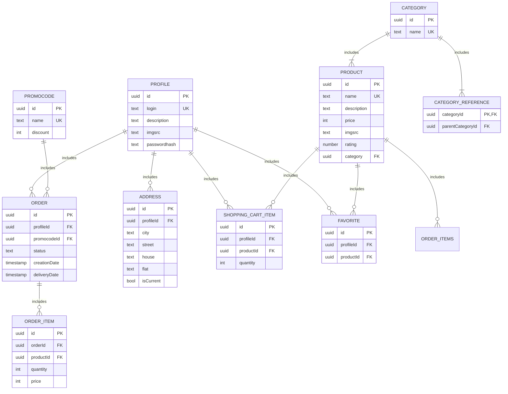

# Фунциональные зависимости
- Таблица profile
   - {id} -> login, description, imgsrc, passwordhash
   - {login} -> id, description, imgsrc, passwordhash

  -В данном отношении потенциальными ключами являются аттрибуты id и login, также все аттрибуты отношения являются атомарными, что соответсвует 1НФ.\
  -Все неключевые аттрибуты(description, imgsrc, passwordhash) зависят от ключей, что соответсвует 2НФ.\
  -Нет атрибутов, зависящих от неключевых аттрибутов, что соответсвует 3НФ.\
  -Любой ключевой аттрибут зависит от любого ключа, что соответсвует НФБК.

- Таблица product
    - {id} -> name, description, price, imgsrc, rating, categoryId
    - {name} -> id, description, price, imgsrc, rating, categoryId

  -В данном отношении потенциальными ключами являются аттрибуты id и name, также все аттрибуты отношения являются атомарными, что соответсвует 1НФ.\
  -Все неключевые аттрибуты(description, price, imgsrc, rating, categoryId) зависят от ключей, что соответсвует 2НФ.\
  -Нет атрибутов, зависящих от неключевых аттрибутов, что соответсвует 3НФ.\
  -Любой ключевой аттрибут зависит от любого ключа, что соответсвует НФБК.

- Таблица order
    - {id} ->  profileId, promocodeId, status, deliveryDate, creationDate

  -В данном отношении потенциальным ключом является аттрибут id, также все аттрибуты отношения являются атомарными, что соответсвует 1НФ.\
  -Все неключевые аттрибуты(profileId, promocodeId, status, deliveryDate, creationDate) зависят от ключа, что соответсвует 2НФ.\
  -Нет атрибутов, зависящих от неключевых аттрибутов, что соответсвует 3НФ.\
  -Ключевой аттрибут один, поэтому отношение соответсвует НФБК.

- Таблица order_item
    - {id} -> quantity, orderId, productId
    - {orderId, productId} -> id, quantity

   -В данном отношении потенциальными ключами являются аттрибуты id и {orderId, productId}, также все аттрибуты отношения являются атомарными, что соответсвует 1НФ.\
  -Неключевой аттрибут(quantity) зависит от ключей, что соответсвует 2НФ.\
  -Нет атрибутов, зависящих от неключевых аттрибутов, что соответсвует 3НФ.\
  -Любой ключевой аттрибут зависит от любого ключа, что соответсвует НФБК.

- Таблица favorite
    - {id} -> profileId, productId
    - {profileId, productId} -> id

  -В данном отношении потенциальными ключами являются аттрибуты id и {profileId, productId}, также все аттрибуты отношения являются атомарными, что соответсвует 1НФ.\
  -Неключевых аттрибутов нет, а любой ключевой аттрибут зависит от любого ключа, что соответсвует НФБК.

- Таблица address
    - {id} -> profileId, city, street, house, flat, isCurrent
    - {profileId, city, street, house, flat} -> id, isCurrent

   -В данном отношении потенциальными ключами являются аттрибуты id и {profileId, city, street, house, flat}, также все аттрибуты отношения являются атомарными, что соответсвует 1НФ.\
  -Неключевой аттрибут(isCurrent) зависит от ключей, что соответсвует 2НФ.\
  -Нет атрибутов, зависящих от неключевых аттрибутов, что соответсвует 3НФ.\
  -Любой ключевой аттрибут зависит от любого ключа, что соответсвует НФБК.

- Таблица category
    - {id} -> name
    - {name} -> id
      
  -В данном отношении потенциальными ключами являются аттрибуты id и name, также все аттрибуты отношения являются атомарными, что соответсвует 1НФ.\
  -Неключевых аттрибутов нет, а любой ключевой аттрибут зависит от любого ключа, что соответсвует НФБК.

- Таблица category_refference
    - {categoryId} -> parentCategoryId

   -В данном отношении потенциальным ключjv являtтся аттрибут categoryId, также все аттрибуты отношения являются атомарными, что соответсвует 1НФ.\
  -Неключевой аттрибут(parentCategoryId) зависит от ключа, что соответсвует 2НФ.\
  -Нет атрибутов, зависящих от неключевого аттрибутов, что соответсвует 3НФ.\
  -Ключевой аттрибут только один, поэтому отношение соответсвует НФБК.

- Таблица shopping_cart_item
    - {id} ->  quantity, profileId, productId
    - {profileId, productId} - id, quantity

   -В данном отношении потенциальными ключами являются аттрибуты id и {profileId, productId}, также все аттрибуты отношения являются атомарными, что соответсвует 1НФ.\
  -Неключевой аттрибут(quantity) зависит от ключей, что соответсвует 2НФ.\
  -Нет атрибутов, зависящих от неключевых аттрибутов, что соответсвует 3НФ.\
  -Любой ключевой аттрибут зависит от любого ключа, что соответсвует НФБК.

- Таблица promocode
    - {id} -> name, discount
    - {name} -> id, discount

   -В данном отношении потенциальными ключами являются аттрибуты id и name, также все аттрибуты отношения являются атомарными, что соответсвует 1НФ.\
  -Неключевой аттрибут(discount) зависит от ключей, что соответсвует 2НФ.\
  -Нет атрибутов, зависящих от неключевых аттрибутов, что соответсвует 3НФ.\
  -Любой ключевой аттрибут зависит от любого ключа, что соответсвует НФБК.

