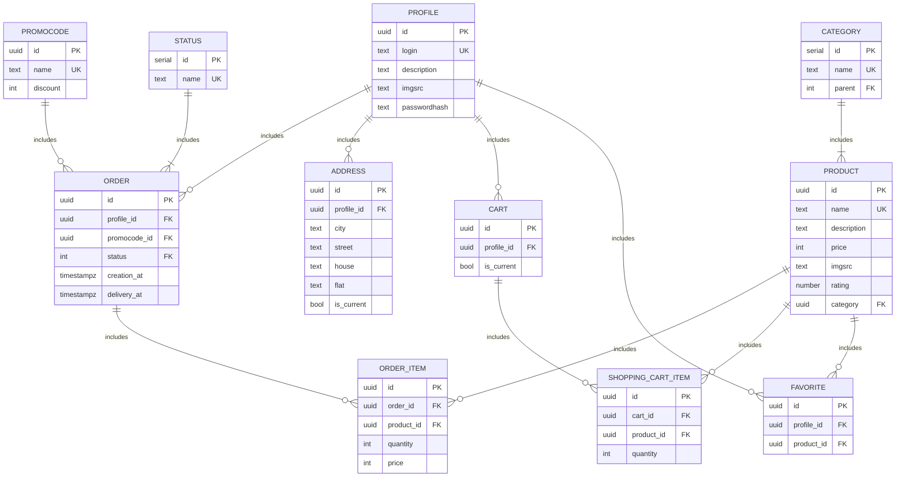

# Фунциональные зависимости
- Таблица profile\
  Хранит информацию о пользователях сервиса
  - {login} -> description, imgsrc, passwordhash

  -В данном отношении потенциальным ключом является аттрибут login, также все аттрибуты отношения являются атомарными, что соответсвует 1НФ.\
  -Все неключевые аттрибуты(description, imgsrc, passwordhash) зависят от ключа, что соответсвует 2НФ.\
  -Нет атрибутов, зависящих от неключевых аттрибутов, что соответсвует 3НФ.\
  -Ключ один, поэтому отношение соответсвует НФБК.

- Таблица product\
  Хранит информацию о товарах
  - {name} -> description, price, imgsrc, rating, category_id

  -В данном отношении потенциальным ключом является аттрибут name, также все аттрибуты отношения являются атомарными, что соответсвует 1НФ.\
  -Все неключевые аттрибуты(description, price, imgsrc, rating, category_id) зависят от ключа, что соответсвует 2НФ.\
  -Нет атрибутов, зависящих от неключевых аттрибутов, что соответсвует 3НФ.\
  -Ключ один, поэтому отношение соответсвует НФБК.

- Таблица order_info\
  Хранит информацию о заказах пользователей
  
  -В данном отношении только неключевые аттрибуты(profile_id, promocode_id, status_id, deliveryDate, creationDate), независящие друг от друга, поэтому ФЗ нет и отношение соответсвует 1НФ, 2НФ, 3НФ, НФБК.

- Таблица status\
  Хранит справочную информацию о статусах
  
  -В данном отношении потенциальным ключом является аттрибут name, также он является единственным аттрибутом, поэтому ФЗ нет и отношение соответсвует 1НФ, 2НФ, 3НФ, НФБК.

- Таблица order_item\
  Хранит информацию о составе заказов
  - {order_id, product_id} -> quantity

  -В данном отношении потенциальным ключом являются аттрибуты {order_id, product_id}, также все аттрибуты отношения являются атомарными, что соответсвует 1НФ.\
  -Неключевой аттрибут(quantity) зависит от ключа, что соответсвует 2НФ.\
  -Нет атрибутов, зависящих от неключевых аттрибутов, что соответсвует 3НФ.\
  -Ключ один, поэтому отношение соответсвует НФБК.

- Таблица favorite\
  Хранит информацию о содержании раздела "Избранное" пользователей
  
  -В данном отношении потенциальным ключом являются аттрибуты {profile_id, product_id}, также они являются единственными аттрибутами и не зависят друг от друга, поэтому ФЗ нет и отношение соответсвует 1НФ, 2НФ, 3НФ, НФБК.

- Таблица address\
  Хранит информацию об адрессах пользователей
  - {profile_id, city, street, house, flat} -> is_current

  -В данном отношении потенциальным ключом являются аттрибуты {profile_id, city, street, house, flat}, также все аттрибуты отношения являются атомарными, что соответсвует 1НФ.\
  -Неключевой аттрибут(is_current) зависит от ключа, что соответсвует 2НФ.\
  -Нет атрибутов, зависящих от неключевых аттрибутов, что соответсвует 3НФ.\
  -Ключ один, поэтому отношение соответсвует НФБК.

- Таблица category\
  Хранит справочную информацию о категориях, на которые распределены товары
  - {name} -> parent
  
  -В данном отношении потенциальным ключом является аттрибут name, также все аттрибуты отношения являются атомарными, что соответсвует 1НФ.\
  -Неключевой аттрибут(parent) зависит от ключа, что соответсвует 2НФ.\
  -Нет атрибутов, зависящих от неключевых аттрибутов, что соответсвует 3НФ.\
  -Ключ один, поэтому отношение соответсвует НФБК.

- Таблица shopping_cart_item\
  Хранит информацию о содержании корзины пользователей
  - {profile_id, product_id} -> quantity

  -В данном отношении потенциальным ключом являются аттрибуты {profile_id, product_id}, также все аттрибуты отношения являются атомарными, что соответсвует 1НФ.\
  -Неключевой аттрибут(quantity) зависит от ключа, что соответсвует 2НФ.\
  -Нет атрибутов, зависящих от неключевых аттрибутов, что соответсвует 3НФ.\
  -Ключ один, поэтому отношение соответсвует НФБК.

- Таблица promocode\
  Хранит информацию о промокодах
  - {name} -> discount

  -В данном отношении потенциальным ключом является аттрибут name, также все аттрибуты отношения являются атомарными, что соответсвует 1НФ.\
  -Неключевой аттрибут(discount) зависит от ключа, что соответсвует 2НФ.\
  -Нет атрибутов, зависящих от неключевых аттрибутов, что соответсвует 3НФ.\
  -Ключ один, поэтому отношение соответсвует НФБК.

