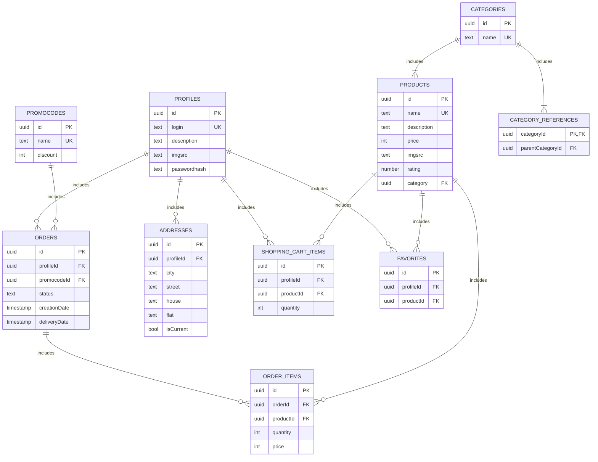

# Фунциональные зависимости
- Таблица profiles
   - {id} -> login, description, imgsrc, passwordhash
   - {login} -> id, description, imgsrc, passwordhash

- Таблица products
    - {id} -> name, description, price, imgsrc, rating, categoryId
    - {name} -> id, description, price, imgsrc, rating, categoryId

- Таблица orders
    - {id} ->  profileId, promocodeId, status, deliveryDate, creationDate

- Таблица order_items
    - {id} -> quantity, orderId, productId
    - {orderId, productId} -> id, quantity

- Таблица favorites
    - {id} -> profileId, productId
    - {profileId, productId} -> id

- Таблица addresses
    - {id} -> profileId, city, street, house, flat, isCurrent
    - {profileId, city, street, house, flat} -> id, isCurrent

- Таблица categories
    - {id} -> name
    - {name} -> id

- Таблица category_refferences
    - {categoryId} -> parentCategoryId

- Таблица shopping_cart_items
    - {id} ->  quantity, profileId, productId
    - {profileId, productId} - id, quantity

- Таблица promocodes
    - {id} -> name, discount
    - {name} -> id, discount

