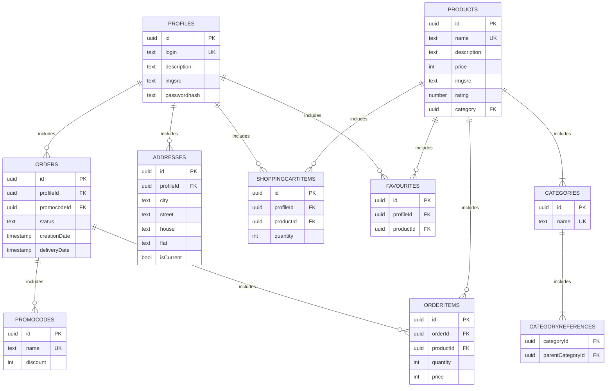

# Фунциональные зависимости
- Таблица profiles
   - {id} -> login, description, imgsrc, passwordhash

- Таблица products
    - {id} -> name, description, price, imgsrc, rating

- Таблица orders
    - {id} ->  profileId, promocodeId

- Таблица orderitems
    - {id, orderId, productId} -> quantity

- Таблица favourites
    - {id} -> profileId, productId 

- Таблица addresses
    - {id} -> profileId, city, street, house, flat, isCurrent

- Таблица categories
    - {id} -> name

- Таблица categoryrefferences
    - {categoryId} -> parentCategoryId

- Таблица shoppingcartitems
    - {id, profileId, productId} ->  quantity

- Таблица promocodes
    - {id} -> name

