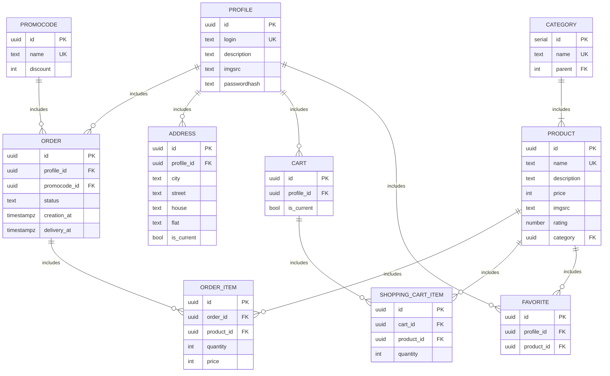

# Фунциональные зависимости
- Таблица profile
  - {id} -> login, description, imgsrc, passwordhash
  - {login} -> description, imgsrc, passwordhash

  -В данном отношении потенциальными ключами являются аттрибуты id и login, также все аттрибуты отношения являются атомарными, что соответсвует 1НФ.\
  -Все неключевые аттрибуты(description, imgsrc, passwordhash) зависят от ключей, что соответсвует 2НФ.\
  -Нет атрибутов, зависящих от неключевых аттрибутов, что соответсвует 3НФ.\
  -Любой ключевой аттрибут зависит от любого ключа, что соответсвует НФБК.

- Таблица product
  - {id} -> name, description, price, imgsrc, rating, category_id
  - {name} -> description, price, imgsrc, rating, category_id

  -В данном отношении потенциальными ключами являются аттрибуты id и name, также все аттрибуты отношения являются атомарными, что соответсвует 1НФ.\
  -Все неключевые аттрибуты(description, price, imgsrc, rating, category_id) зависят от ключей, что соответсвует 2НФ.\
  -Нет атрибутов, зависящих от неключевых аттрибутов, что соответсвует 3НФ.\
  -Любой ключевой аттрибут зависит от любого ключа, что соответсвует НФБК.

- Таблица order
  - {id} ->  profile_id, promocode_id, status, deliveryDate, creationDate

  -В данном отношении потенциальным ключом является аттрибут id, также все аттрибуты отношения являются атомарными, что соответсвует 1НФ.\
  -Все неключевые аттрибуты(profile_id, promocode_id, status, deliveryDate, creationDate) зависят от ключа, что соответсвует 2НФ.\
  -Нет атрибутов, зависящих от неключевых аттрибутов, что соответсвует 3НФ.\
  -Ключевой аттрибут один, поэтому отношение соответсвует НФБК.

- Таблица order_item
  - {id} -> quantity, order_id, product_id
  - {order_id, product_id} -> quantity

  -В данном отношении потенциальными ключами являются аттрибуты id и {order_id, product_id}, также все аттрибуты отношения являются атомарными, что соответсвует 1НФ.\
  -Неключевой аттрибут(quantity) зависит от ключей, что соответсвует 2НФ.\
  -Нет атрибутов, зависящих от неключевых аттрибутов, что соответсвует 3НФ.\
  -Любой ключевой аттрибут зависит от любого ключа, что соответсвует НФБК.

- Таблица favorite
  - {id} -> profile_id, product_id
  - {profile_id, product_id} -> id

  -В данном отношении потенциальными ключами являются аттрибуты id и {profile_id, product_id}, также все аттрибуты отношения являются атомарными, что соответсвует 1НФ.\
  -Неключевых аттрибутов нет, а любой ключевой аттрибут зависит от любого ключа, что соответсвует НФБК.

- Таблица address
  - {id} -> profile_id, city, street, house, flat, is_current
  - {profile_id, city, street, house, flat} -> is_current

  -В данном отношении потенциальными ключами являются аттрибуты id и {profile_id, city, street, house, flat}, также все аттрибуты отношения являются атомарными, что соответсвует 1НФ.\
  -Неключевой аттрибут(is_current) зависит от ключей, что соответсвует 2НФ.\
  -Нет атрибутов, зависящих от неключевых аттрибутов, что соответсвует 3НФ.\
  -Любой ключевой аттрибут зависит от любого ключа, что соответсвует НФБК.

- Таблица category
  - {id} -> name
  - {name} -> id

  -В данном отношении потенциальными ключами являются аттрибуты id и name, также все аттрибуты отношения являются атомарными, что соответсвует 1НФ.\
  -Неключевых аттрибутов нет, а любой ключевой аттрибут зависит от любого ключа, что соответсвует НФБК.

- Таблица category_refference
  - {category_id} -> parentCategory_id

  -В данном отношении потенциальным ключом является аттрибут category_id, также все аттрибуты отношения являются атомарными, что соответсвует 1НФ.\
  -Неключевой аттрибут(parentCategory_id) зависит от ключа, что соответсвует 2НФ.\
  -Нет атрибутов, зависящих от неключевого аттрибутов, что соответсвует 3НФ.\
  -Ключевой аттрибут только один, поэтому отношение соответсвует НФБК.

- Таблица shopping_cart_item
  - {id} ->  quantity, profile_id, product_id
  - {profile_id, product_id} - quantity

  -В данном отношении потенциальными ключами являются аттрибуты id и {profile_id, product_id}, также все аттрибуты отношения являются атомарными, что соответсвует 1НФ.\
  -Неключевой аттрибут(quantity) зависит от ключей, что соответсвует 2НФ.\
  -Нет атрибутов, зависящих от неключевых аттрибутов, что соответсвует 3НФ.\
  -Любой ключевой аттрибут зависит от любого ключа, что соответсвует НФБК.

- Таблица promocode
  - {id} -> name, discount
  - {name} -> discount

  -В данном отношении потенциальными ключами являются аттрибуты id и name, также все аттрибуты отношения являются атомарными, что соответсвует 1НФ.\
  -Неключевой аттрибут(discount) зависит от ключей, что соответсвует 2НФ.\
  -Нет атрибутов, зависящих от неключевых аттрибутов, что соответсвует 3НФ.\
  -Любой ключевой аттрибут зависит от любого ключа, что соответсвует НФБК.

